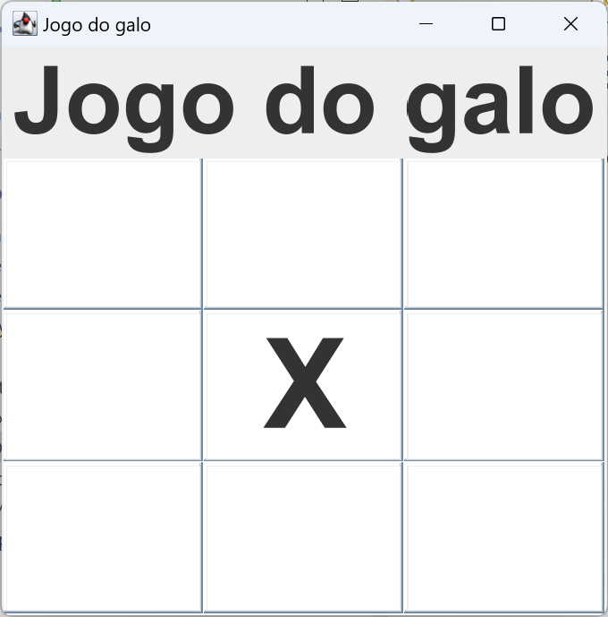

# Jogo Do Galo GUI

This project provides a GUI built with Java SWING for playing Tic Tac Toe (Jogo do Galo)



The actual implementation for the game is not in this library, you have to implement it yourself, in order to do that you
must provide an implementation for the `IBoard` interface.

```java
package pt.brunojesus.jogodogalo.gui;


public interface IBoard {
	public void play(int x, int y) throws Exception;
	public String getItemInPosition(int x, int y);
	public String getWinner();
	public void reset();
}
```

## Installing

Add `mvn.brunojesus.pt` repository to your project's `pom.xml` `<distributionManagement>` section:

```xml
<distributionManagement>
    <repository>
        <id>mvn-brunojesus</id>
        <name>Bruno Jesus MVN Repo</name>
        <url>https://mvn.brunojesus.pt/releases</url>
    </repository>
</distributionManagement>
```

Add the dependency to your project under `<dependencies>`:

```xml
<dependencies>
    <dependency>
        <groupId>pt.brunojesus.jogodogalo</groupId>
        <artifactId>gui</artifactId>
        <version>0.0.1</version>
    </dependency>
</dependencies>
```